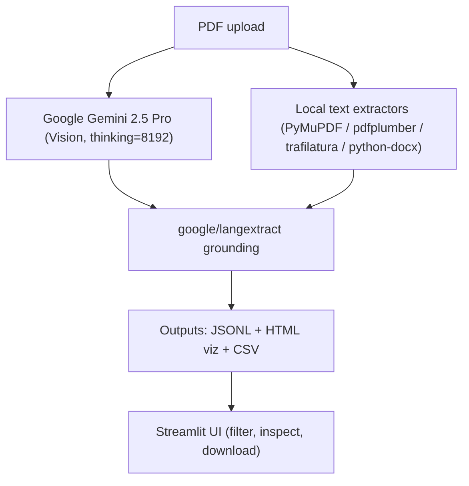

# Gemini Vision + LangExtract (Streamlit + CLI)



Google Gemini 2.5 Pro (Vision + thinking) + google/langextract for grounded extractions from contracts (and other long PDFs). Vision path sends PDF bytes directly—no OCR setup.

Repo: https://github.com/lesteroliver911/gemini-vision-langextract-streamlit

## Demo
<video src="https://raw.githubusercontent.com/lesteroliver911/gemini-vision-langextract-streamlit/main/assets/gemini-langextract.mp4" controls muted playsinline width="800"></video>

## What you get
- Gemini 2.5 Pro Vision path (PDF bytes in, extractions out). Thinking budget 8192.
- Grounded extractions and interactive HTML visualization (google/langextract).
- Streamlit UI: upload a PDF, filter by `extraction_class`, inspect attributes, download CSV/JSON.
- CLI for local runs.
- Robust text fallbacks: PyMuPDF, pdfplumber, trafilatura, python-docx.

## Tech
- Google Gemini 2.5 Pro via `google-genai`
- `google/langextract`
- Streamlit
- PyMuPDF, pdfplumber, trafilatura, python-docx, BeautifulSoup
- Python 3.13

## Quickstart (local)
Requirements: Python 3.13 on macOS/Linux.

```bash
git clone https://github.com/lesteroliver911/gemini-vision-langextract-streamlit
cd gemini-vision-langextract-streamlit

python3 -m venv .venv
source .venv/bin/activate
python -m pip install --upgrade pip
pip install \
  google-genai langextract streamlit pymupdf pdfplumber \
  python-docx trafilatura beautifulsoup4 lxml python-dotenv pandas
```

Create `.env` (pick either key):
```bash
echo 'GEMINI_API_KEY=YOUR_KEY' > .env
# or
echo 'LANGEXTRACT_API_KEY=YOUR_KEY' >> .env
```

A sample PDF is included at `test_docs/med_dir_actualcontract.pdf`.

## Run the Streamlit UI
```bash
source .venv/bin/activate
streamlit run streamlit_app.py
```
- Upload a PDF and click “Process PDF.” Vision is on by default.
- Outputs in `test_output/` as `.jsonl`, `.html`, `.csv`.

## Run the CLI
```bash
source .venv/bin/activate
python contract_clause_extractor.py \
  --file test_docs/med_dir_actualcontract.pdf \
  --model gemini-2.5-pro \
  --passes 1 --max-workers 1 --buffer 4000 \
  --output demo_run --csv --vision
```

## Notes
- This is an engineering demo to help you prototype extractions. Review outputs before acting on them.
- License: MIT
